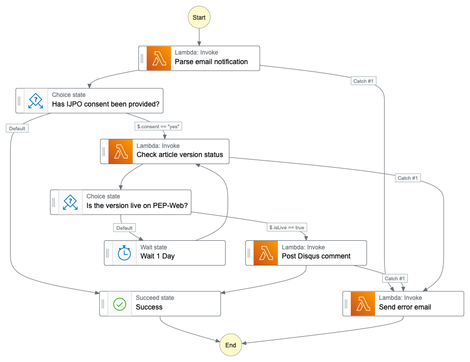

<a name="readme-top"></a>

<br />
<div align="center">
  <a href="https://github.com/jordanallen-dev/disqus-comment-service">
    
  </a>

<h3 align="center">Disqus Comment Service</h3>

  <p align="center">
    Automate the publishing of IJPO letters to PEP-Web Disqus comments
    <br />
    <br />
    <a href="https://github.com/jordanallen-dev/disqus-comment-service/issues">Report Bug</a>
    ·
    <a href="https://github.com/jordanallen-dev/disqus-comment-service/issues">Request Feature</a>
  </p>
</div>

<details>
  <summary>Table of Contents</summary>
  <ol>
    <li>
      <a href="#about-the-project">About The Project</a>
    </li>
    <li>
      <a href="#inbound-email-format">Inbound Email Format</a>
    </li>
    <li>
      <a href="#state-machine-architecture">State Machine Architecture</a>
    </li>
    <li>
      <a href="#prerequisites">Prerequisites</a>
    </li>
    <li>
      <a href="#installation">Installation</a>
    </li>
    <li>
      <a href="#useful-commands">Useful Commands</a>
    </li>
    <li>
      <a href="#environment-variables">Environment Variables</a>
    </li>
    <li>
      <a href="#first-time-deployment">First Time Deployment</a>
    </li>
    <li>
      <a href="#ses-setup">SES Setup</a>
    </li>
    <li>
      <a href="#tests">Tests</a>
    </li>
    <li>
      <a href="#local-execution">Local Execution</a>
    </li>
    <li>
      <a href="#example-step-function-payload">Example Step Function Payload</a>
    </li>
    <li>
      <a href="#contributing">Contributing</a>
    </li>
  </ol>
</details>

## About The Project

This project has been built to automate the publishing of letters from Manuscript Central to PEP-Web Disqus comments using AWS Step Functions.

The infrastructure is deployed via CDK and defined within the `lib/stack.ts` entrypoint.

Letters within Manuscript can be exported via email directly to this service's `INGESTION_EMAIL_ADDRESS` email address.

Once an email is received, an SNS notification will be triggered and fed into a new execution of the commenting state machine via an intermediary Lambda function.

This intemediary step is necessary, as Step Functions cannot yet be triggered diretly from SNS.

The email contents are then parsed and the resultant values are used to determine IJPO consent status and assert that the relevant article is live on PEP-Web before publishing a comment via the Disqus API.

Any errors are caught and sent as an email notification to the `EMAIL_NOTIFICATION_RECIPIENT` using SES.

<p align="right">(<a href="#readme-top">back to top</a>)</p>

## Inbound Email Format

The state machine expects to recieve email notifications with the following format:

### Subject Format

ARTICLE_ID.REVISION@IJP_OPEN_CONSENT_WITHDRAWN

Examples:

- IJPOPEN.001.0001A.r3@no - consent not withdrawn, proceed with comment
- IJPOPEN.003.0003B.r1@yes - consent withdrawn, exit early

### Body Format

The entire plain text body of the email will be posted to the Disqus thread of the PEP-Web article.

Please ensure the total body length is less than 20,000 characters.

<p align="right">(<a href="#readme-top">back to top</a>)</p>

## State Machine Architecture



<p align="right">(<a href="#readme-top">back to top</a>)</p>

## Prerequisites

Before you start, you'll need to install the AWS CDK and AWS CLI:

1. Install the AWS CLI

   https://docs.aws.amazon.com/cli/latest/userguide/getting-started-install.html

2. Install CDK
   ```sh
   npm install -g aws-cdk
   ```

<p align="right">(<a href="#readme-top">back to top</a>)</p>

## Installation

1. Clone the repo
   ```sh
   git clone https://github.com/jordanallen-dev/disqus-comment-service.git
   ```
2. Install NPM packages
   ```sh
   npm install
   ```
   <p align="right">(<a href="#readme-top">back to top</a>)</p>

## Useful Commands

- `npm run build` compile typescript to js
- `npm run watch` watch for changes and compile
- `npm run test` perform the jest tests
- `npm run lint` perform linting
- `npm run test:watch` perform the jest tests in watch mode
- `npm run deploy:ci` deploy the stack, skipping user confirmation
- `cdk deploy` deploy this stack to your default AWS account/region
- `cdk diff` compare deployed stack with current state
- `cdk synth` emits the synthesized CloudFormation template

 <p align="right">(<a href="#readme-top">back to top</a>)</p>

## Environment Variables

There are currently 9 required environment variables:

1. `AWS_ACCESS_KEY` - IAM user with admin permissions for CDK deployments
2. `AWS_SECRET_KEY` - IAM user with admin permissions for CDK deployments
3. `DISQUS_FORUM` - Disqus shortname
4. `DISQUS_PUBLIC` - Disqus application public key
5. `DISQUS_SECRET` - Disqus application secret key
6. `INGESTION_EMAIL_ADDRESS` - Internal email address to receive IJPO letters and send email notifications
7. `EMAIL_NOTIFICATION_RECIPIENT` - Email notification recipient
8. `PEP_API_KEY` - PEP API Key
9. `PEP_API_BASE_URL` - PEP API base URL

### Local Configuration

Make a copy of the included `.env-template` file and call it `.env`.

Fill your `.env` file with the values for each listed variable.

### CI/CD Configuration

If you plan on using the included GitHub Action workflows for continuous deployment (CD), you'll need to configure each of the required variables within the GitHub secrets of your repo:

https://docs.github.com/en/actions/security-guides/encrypted-secrets#creating-encrypted-secrets-for-a-repository

<p align="right">(<a href="#readme-top">back to top</a>)</p>

## First Time Deployment

If you are deploying the project to an AWS account for the first time, you'll need to configure your AWS environment using CDK's bootstrap command:

1. Configure your AWS credentials

   ```sh
    aws configure # follow on-screen prompts
   ```

   https://docs.aws.amazon.com/cli/latest/userguide/cli-configure-quickstart.html

2. Bootstrap your AWS account
   ```sh
   cdk bootstrap aws://ACCOUNT-NUMBER/REGION
   ```
3. You can now deploy using `cdk deploy` or (recommended) the included GitHub Actions workflows

<p align="right">(<a href="#readme-top">back to top</a>)</p>

## SES Setup

In order to receive inbound emails and send outbound notifications, you'll need to manually configure your domain and recipient email in SES.

First configure your internal email address for sending notifications and receiving letters:

1. Visit the verified identities page of SES within the AWS console (https://us-east-1.console.aws.amazon.com/ses/home?region=us-east-1#/verified-identities)
2. Click "Create Identity"
3. Select "Domain" and enter the domain of your `INGESTION_EMAIL_ADDRESS`
4. Click "Create Identity" again
5. If your domain is not configured in Route53, follow the on-screen instructions to validate your domain using CNAME DNS records.
6. Wait until the identity status displays as "Verified"

Next, configure the external `EMAIL_NOTIFICATION_RECIPIENT` address that you wish to recieve error notifications to:

1. Visit the verified identities page again
2. Click "Create Identity"
3. Select "Email address" and enter your `EMAIL_NOTIFICATION_RECIPIENT` address
4. Click "Create Identity" again
5. Click the link in the confirmation email in the `EMAIL_NOTIFICATION_RECIPIENT` inbox

<p align="right">(<a href="#readme-top">back to top</a>)</p>

## Tests

The project contains a full suite of test that are executed using the Jest test runner.

```sh
npm run test # run all tests
```

```sh
npm run test:watch # run in interactive watch mode
```

<p align="right">(<a href="#readme-top">back to top</a>)</p>

## Local Execution

To invoke individual Lambdas directly on your machine, you can use the AWS SAM CLI. Please follow the [Locally testing AWS CDK applications](https://docs.aws.amazon.com/serverless-application-model/latest/developerguide/serverless-cdk-testing.html) guide on AWS to learn more.

It's also possible to execute entire Step Functions locally. Please follow the [Testing Step Functions State Machines Locally](https://docs.aws.amazon.com/step-functions/latest/dg/sfn-local.html) guide on AWS if you're interested in trying it out.

<p align="right">(<a href="#readme-top">back to top</a>)</p>

## Example Step Function Payload

If you want to manually trigger a step function for testing / debugging, you can use the following payload stub:

```json
{
  "notificationType": "Received",
  "content": "Return-Path: <61967230-7A45-4A9D-BEC9-87CBCF2211C9@example.com>\r\nReceived: from a9-183.smtp-out.amazonses.com (a9-183.smtp-out.amazonses.com [54.240.9.183])\r\n by inbound-smtp.us-east-1.amazonaws.com with SMTP id d6iitobk75ur44p8kdnnp7g2n800\r\n for recipient@example.com;\r\n Fri, 11 Sep 2015 20:32:33 +0000 (UTC)\r\nDKIM-Signature: v=1; a=rsa-sha256; q=dns/txt; c=relaxed/simple;\r\n\ts=ug7nbtf4gccmlpwj322ax3p6ow6yfsug; d=amazonses.com; t=1442003552;\r\n\th=From:To:Subject:MIME-Version:Content-Type:Content-Transfer-Encoding:Date:Message-ID:Feedback-ID;\r\n\tbh=DWr3IOmYWoXCA9ARqGC/UaODfghffiwFNRIb2Mckyt4=;\r\n\tb=p4ukUDSFqhqiub+zPR0DW1kp7oJZakrzupr6LBe6sUuvqpBkig56UzUwc29rFbJF\r\n\thlX3Ov7DeYVNoN38stqwsF8ivcajXpQsXRC1cW9z8x875J041rClAjV7EGbLmudVpPX\r\n\t4hHst1XPyX5wmgdHIhmUuh8oZKpVqGi6bHGzzf7g=\r\nFrom: sender@example.com\r\nTo: recipient@example.com\r\nSubject: IJP.103.0001A@no\r\nMIME-Version: 1.0\r\nContent-Type: text/plain; charset=UTF-8\r\nContent-Transfer-Encoding: 7bit\r\nDate: Fri, 11 Sep 2015 20:32:32 +0000\r\nMessage-ID: <61967230-7A45-4A9D-BEC9-87CBCF2211C9@example.com>\r\nX-SES-Outgoing: 2015.09.11-54.240.9.183\r\nFeedback-ID: 1.us-east-1.Krv2FKpFdWV+KUYw3Qd6wcpPJ4Sv/pOPpEPSHn2u2o4=:AmazonSES\r\n\r\nExample content\r\n"
}
```

Please replace `IJP.103.0001A@no` with your email subject and `Example content` with your body content.

<p align="right">(<a href="#readme-top">back to top</a>)</p>

## Contributing

If you have a suggestion that would make this better please create a pull request. You can also simply open an issue with the tag "enhancement".

1. Create your Feature Branch (`git checkout -b feature/AmazingFeature`)
2. Commit your Changes (`git commit -m 'Add some AmazingFeature'`)
3. Push to the Branch (`git push origin feature/AmazingFeature`)
4. Open a Pull Request

<p align="right">(<a href="#readme-top">back to top</a>)</p>
